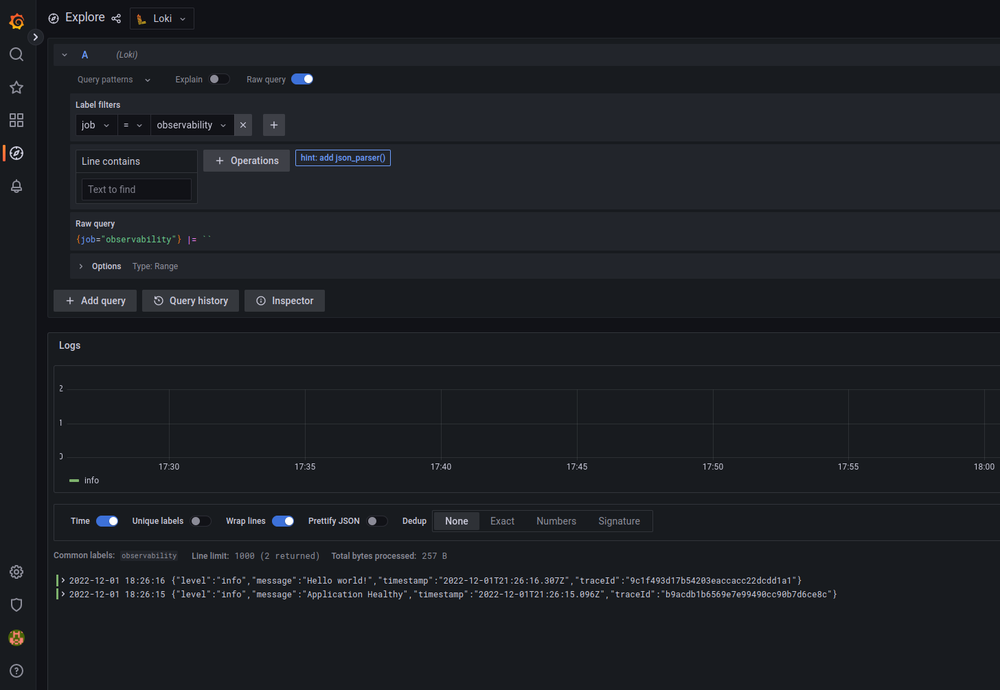
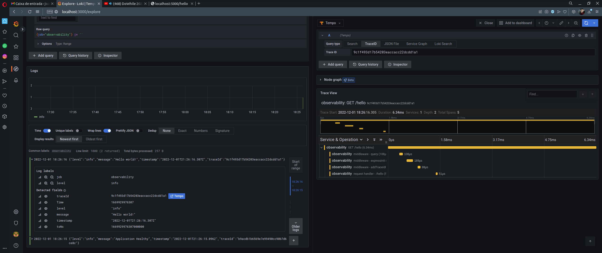

# Observabilidade com Grafana e Opentelemetry para NodeJs

Esse projeto demonstra como fazer a observabilidade de uma aplicação Node utilizando as seguintes tecnologias:

- [Grafana Loki](https://grafana.com/oss/loki/) - Para logs distribuídos
- [Grafana Tempo](https://grafana.com/oss/tempo/) - Para tracing distribuído
- [Grafana](https://grafana.com/) - Para visualização da stack
- [Opentelemetry](https://opentelemetry.io/) - Para instrumentação da aplicação

## Por que essa stack?

Há várias opções de tecnologias para fazer a observabilidade de nossas aplicações, mas nem todas são simples e baratas de manter. Stacks como ELK são excelentes alternativas para escolher, porém são tecnologias caras e que consomem muitos recursos computacionais.

E além de ter várias opções para essa escolha, como podemos fazer para correlacionar nossos logs e métricas? Precisamos ir de uma plataforma à outra para poder fazer o troubleshooting.

Por isso essa stack foi escolhida!

Com o Grafana Loki e Grafana Tempo é possível correlacionar os logs e traces dentro do Grafana e, com isso, maximizando a produtividade no momento de análise de logs/traces. Além de ser ferramentas simples de serem utilizadas, leves e baratas, prontas para ambientes produtivos de alto escalonamento.

## Como o fluxo é feito

A aplicação em NodeJs utiliza as libs do Opentelemetry para instrumentar todos os traces, enviando para o Grafana Tempo.

Os logs são enviados diretamente para o Grafana Loki.

O grafana se conecta com as bases de dados do Loki e do Tempo para consumir os dados e criar as visualizações. Todos os logs e traces estão correlacionados, sendo assim podemos transitar entre a visualização dos logs e dos traces.

## Inicializando a aplicação

```bash
docker compose up -d
```

A aplicação NodeJs inicializará na porta `5000`

Acesse a seguinte rota: `http://localhost:5000/hello`

#### Visualize os logs no grafana no painel [explore](http://localhost:3000/explore?orgId=1&left=%7B"datasource":"loki","queries":%5B%7B"refId":"A","datasource":%7B"type":"loki","uid":"loki"%7D,"editorMode":"builder","expr":"%7Bjob%3D%5C"observability%5C"%7D%20%7C%3D%20%60%60","queryType":"range"%7D%5D,"range":%7B"from":"now-1h","to":"now"%7D%7D):

</img>

#### Visualize o rastreamento no grafana expandindo a linha de código e clicando no link para o Tempo:

</img>

## Referências

- [Opentelemetry com Javascript](https://opentelemetry.io/docs/instrumentation/js/)
- [Documentação do Grafana Loki](https://grafana.com/docs/loki/latest/)
- [Documentação do Grafana Tempo](https://grafana.com/docs/tempo/latest/getting-started/?pg=oss-tempo&plcmt=resources)
- [Especificação de Telemetria](https://github.com/open-telemetry/opentelemetry-specification/blob/main/specification/overview.md)